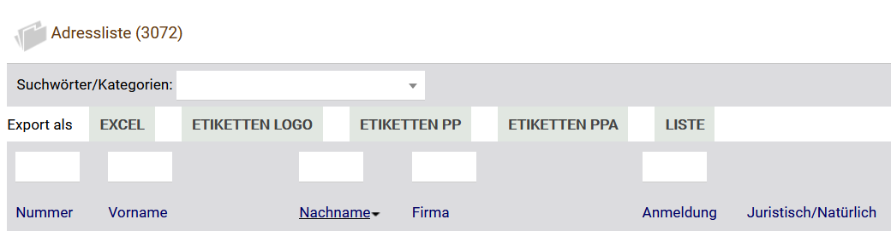
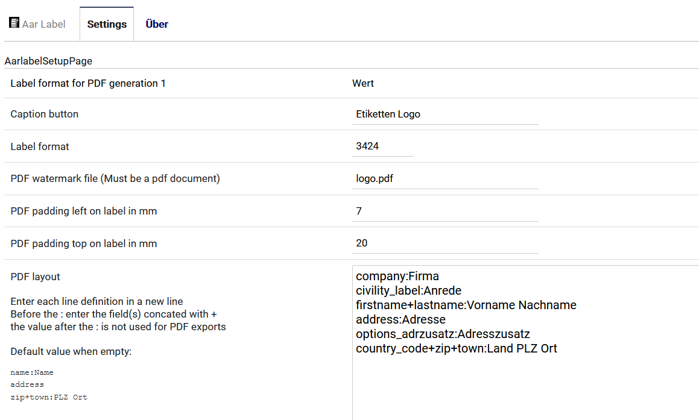

Dolibarr Aarlabel module
========================

This module allows you to export any list from
dolibarr into xlsx, a simple html list or
up to eight predefined PDF documents.

You can also define several avery label formats
to print stickers with your address information
or product informations

Supported formats are:

    Avery 3422
    Avery 3424
    Avery 3651
    Avery 5160
    Avery 5161
    Avery 5162
    Avery 5163
    Avery 5164
    Avery L7163
    Avery 8600
	
For PDF outputs you can also specify a template to use
which can for example contain your company logo
or some other images

Example settings for address labels with avery 3424 format and
a pdf template in logo.pdf

Requires Dolibarr 13, since some paths to the xlsx
libraries have changed. If you wish to receive a version for
Dolibarr 9, then contact me.

# Installation
Just put the content of this distribution into
a folder named aardedupe in your /custom dolibarr
folder and activate it in the module config

This module requires the php mbstring and xml modules
to generate xlsx exports